<!-- Generated by GitHub Profile Agent Console. Edit profile.config.json, then run npm run generate. -->

  <picture>
    <source media="(max-width: 760px) and (prefers-color-scheme: dark)" srcset="./assets/hero/agent-console-fa4cdb97-mobile-dark.svg">
    <source media="(max-width: 760px)" srcset="./assets/hero/agent-console-fa4cdb97-mobile-light.svg">
    <source media="(prefers-color-scheme: dark)" srcset="./assets/hero/agent-console-fa4cdb97-dark.svg">
    <source media="(prefers-color-scheme: light)" srcset="./assets/hero/agent-console-fa4cdb97-light.svg">
    
  </picture>

  

## About Me

I build practical systems at the intersection of technology and real-world problems.

Currently focused on learning, building, and sharing what actually works.

## Current Focus

| Area | What I am exploring |
| --- | --- |
| **AI Agents** | Autonomous workflows, tool use, evaluation, and reliable agent behavior. |
| **Applied AI** | Turning model capabilities into useful and testable software systems. |
| **Developer Tools** | Better workflows for building, testing, and operating modern software. |

## Featured Work

| Project | Focus | Why it matters |
| --- | --- | --- |
| [**Profile_**](https://github.com/Andhyonoki/Profile_) | GitHub profile automation | An automated system that generates a personal GitHub profile README and hero assets. |

## Research Direction

I am interested in systems that can observe state, use tools, evaluate outcomes, and take bounded actions with clear evidence and human oversight.

## Tech Stack

`TypeScript` · `Next.js` · `Python` · `PostgreSQL` · `Playwright`

## Recent Activity

<!-- AUTO:ACTIVITY:START -->
_Recent public activity will appear here after the workflow runs._
<!-- AUTO:ACTIVITY:END -->

---

  Building thoughtful systems and sharing what works.

